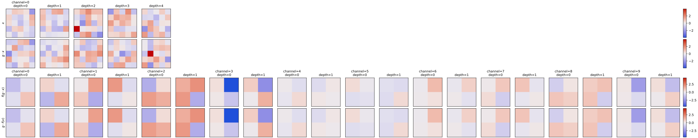
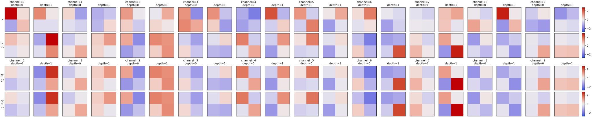
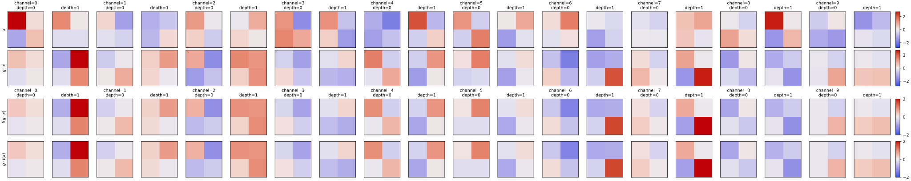
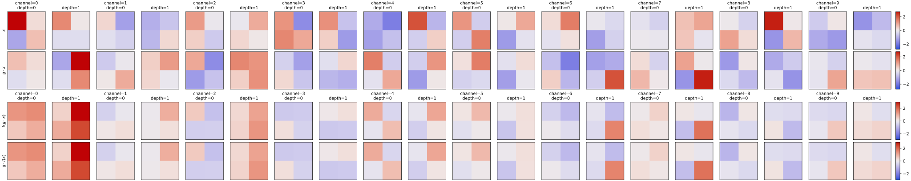
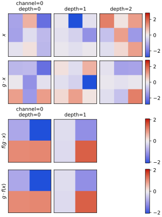
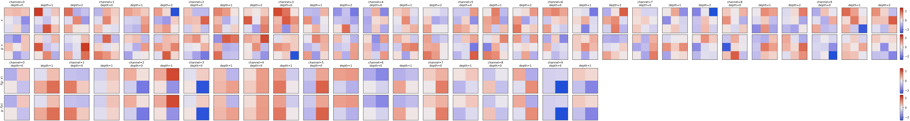
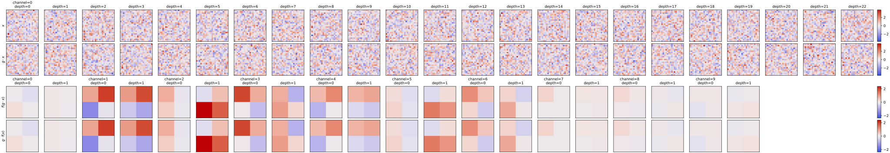
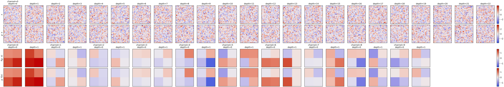

**************************
Check Fourier equivariance
**************************

2023/05/25:

For the same reasons described in :expt:`2`, I wanted to manually confirm 
that the components of my frequency-domain CNNs individually and jointly 
maintain equivariance.

Results
=======

Software versions
-----------------
- ESCNN: ``1467ccc082553b8715591f1ad58985d5aff08a43``

Convolution
-----------

- There are 10 output channels because the fibers are direct sums of one scalar 
  and three 3D vectors.

- As expected, convolution maintains equivariance very well.

- These convolutions include a stride of 2.

  - This will be discussed more in the "Pooling" section, but there isn't 
    really a good pooling operation for frequency-domain fibers. 

  - Strided convolution is therefore one of the only ways to shrink the network 
    at each layer.

  - Making strides like this reduces translational equivariance: Only 
    translations equal to the product of all the strides in the network will 
    truly be equivariant.

  - That said, already the best translational equivariance I can get is limited 
    by the size of the voxels.

- Note that I only tested with a stride, but I'm sure that it would be 
  equivariant without as well.

Batch normalization
-------------------

- As expected, batch normalization has no effect on the outputs.

- Batch normalization fails when the minibatch and spatial dimensions of the 
  input are all 1.  The reason is that it's not possible to calculate variance 
  from only one sample.  Note that it doesn't matter how many channels there 
  are: the normalization is performed within each channel separately.

  This has made me think about when I want to do batch normalization.  In real 
  training, I wouldn't use a minibatch dimension of 1, so this error wouldn't 
  come up.  But I also don't expect my minibatches to be very large, so this 
  normalization could be quite noisy for the last layers of a CNN, when the 
  spatial dimensions are smallest.  Based on this, I'm currently inclined to 
  skip the batch normalization step that would otherwise happen just after the 
  last convolution.

Nonlinearities
--------------
Norm-based:

- The output is just a re-scaled version of the input.

  - This is true in the larger 5x5x5 output as well, but I only show the 2x2x2 
    output above due to space considerations.

- As expected, equivariance is maintained very well.

Inverse Fourier transform:

- Equivariance is maintained very well.

  - The 5x5x5 output looks just as good.

  - I expected some error due to discretization, but any such error is 
    imperceptible.

  - I didn't play around with the parameters of the nonlinearity to see at what 
    point the error becomes more pronounced.  The parameters I'm using I took 
    directly from the ESCNN SO(3) example.

- There is no default grid: you can see this by reading the code or by just 
  trying to instantiate a `FourierPointwise` nonlinearity without specifying 
  grid parameters.  I've been using the grid parameters that are default in the 
  SO(3) CNN example, but this is probably something worth playing with.

Gated non-linearity:

- I haven't tried this one yet.

Pooling
-------
Most of the pooling modules in ESCNN require fibers that are compatible with 
pointwise activations, e.g. regular or trivial representations.  
``NormMaxPool`` is an exception, but it is only implemented for 2D spaces.  The 
only exception I'm aware of is the antialiased pointwise average pool module.  
This module basically applies a Gaussian blur between matching entries in 
adjacent fibers.

.. update:: 2023/11/30

  For a long time, I thought that this module didn't maintain equivariance at 
  all.  It turns out that the problem was that I was using even input 
  dimensions (4 and 10, specifically).  With stride = 2, the filter will only 
  line up with every edge of the image if the image's spatial dimensions are 
  all odd.  And if the filter doesn't line up with the edge, then 
  rotated/non-rotated inputs will give different outputs.

Applied to scalar fibers:

- Equivariance is maintained very well.

Applied to Fourier fibers:

- Equivariance is maintained very well.

3-layer CNN
-----------
Norm-based nonlinearity:

Inverse Fourier nonlinearity:

- Results for the 5x5x5 outputs are similar.

- Both networks maintain equivariance.

- The Fourier nonlinearity gives more diverse outputs.  That may be an 
  indication that it will be easier to train, but I haven't thought very hard 
  about it.

- Not shown in these results, but the batch normalization layers have a strong 
  stabilizing influence on the magnitude of the final outputs.

Conclusions
===========
- I'm able to construct equivariant CNNs with Fourier fibers.

- The pointwise average pool module should not be used with Fourier fibers.

  - Perhaps the fact that the name includes the word "pointwise" is a clue that 
    I shouldn't have expected this to work.
    
  - That said, other modules actually check for compatible fibers, plus this is 
    the module used in the SO(3) example.  So I don't think my expectation was 
    unreasonable.

  - It's possible that I'm not using this module correctly, e.g. I'm not 
    setting some parameter properly.  Maybe the σ parameter needs to be tuned 
    to the size of the input, or maybe the padding is important.  I didn't 
    really look into it that closely.
