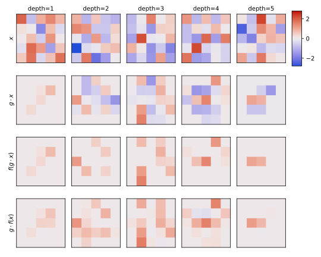

******************************
Check icosahedral equivariance
******************************

2023/05/22:

Before attempting to do any training, I wanted to verify that my networks 
maintained equivariance.  This is done by feeding the network random values, 
and checking that they behave as expected after being rotated.  In principle, 
the escnn library should make it pretty hard to unknowingly break equivariance.  
I still wanted to do this check anyways, partially to make sure I wasn't making 
some big mistake, and partially just to get more experience with the library.

To my surprise, I initially found that my networks did not maintain 
equivariance.  I eventually determined that this was not because of the 
networks themselves, but because of the interpolation algorithm being used to 
generate some rotations.  This led to some insights that might be good to keep 
in mind when verifying equivariance in the future.

Results
=======

Software versions
-----------------
- ESCNN: ``7fcc1c76bc594aea297b929a767703cb66fce9d0``

Rotations
---------
In all of the following experiments, I compared two different rotations, one 
that doesn't require interpolation ("exact") and one that does 
("interpolated").  Here are the two rotations applied to a cube, which makes it 
easy to see why only the second requires interpolation:

Note that I found these angles simply by checking equivariance for all the 
transformations associated with the icosahedral group, then arbitrarily picking 
on transformation that seemed to maintain equivariance ("exact") and one that 
didn't ("interpolated").

ReLU
----
I first checked the equivariance of the ReLU layer, because it's very simple 
and doesn't change the shape of the input.  I varied the following 
factors:

- Output size:

  - 2x2x2
  - 5x5x5

- Rotation

  - exact
  - interpolated

- Interpolation algorithm (only for interpolated rotations, see
  `scipy.ndimage.affine_transform` for details):

  - constant
  - grid-constant

In general, the way to interpret the following plots is to compare the 
:math:`f(g \cdot x)` images to the :math:`g \cdot f(x)` images.  If the 
operation being tested is equivariant, these two images should be identical.

No interpolation:

- Equivariance is preserved exactly, regardless of input size.

Constant interpolation:

- Rotating the input :math:`g \cdot x` results in a zero vector.

  This is because of how the interpolation algorithm works.  In general, it 
  starts at each output point, applies the inverse transformation to get an 
  input coordinate, then interpolates between nearby input points for which 
  values are known.  However, the "constant" algorithm treats any point that 
  falls outside of the original input as zero, no matter how close to the 
  original input it is.  With such small inputs as these, every point ends up 
  getting clipped in this way.

- Using a larger input ameliorates this problem (although note that the outer 
  edge of the depth=1 and depth=5 layers are still lost, for the same reason as 
  before).

- Equivariance is preserved pretty well, but not exactly.  Presumably this is 
  due to the interpolation, but I can't say exactly how.

Grid-constant interpolation:

- Grid-constant interpolation gives better results for small inputs.

  This interpolation strategy treats all points outside the original input as 
  zero, but still interpolates with the nearest points inside the original 
  input.

- Equivariance is pretty good, but not perfect.

  Note that :math:`g \cdot f(x)` is more positive that :math:`f(g \cdot x)`.  
  This is because the former applies the interpolation after the ReLU.  The 
  ReLU gets rid of all the negative values, so the interpolation can only make 
  things slightly positive.  In contrast, the latter applies the ReLU second, 
  so it has true 0 values.

  Not shown here, but this effect if much more pronounced if most of the input 
  is negative to begin with.

Pool
----
Next, I checked the equivariance of the antialiased max pool layer.  I varied 
the same factors as before, but this time I had to double the input sizes to 
get the desired output sizes:

No interpolation:

- Equivariance is preserved exactly, regardless of input size.

Constant interpolation:

- :math:`g \cdot f(x)`: After applying the pooling operation, the output is 
  2x2x2.  As we saw above in the ReLU section, trying to rotate images of that 
  size with constant interpolation results in everything being clipped to zero.

- With this bigger input, you can start to see the "spherical" clipping caused 
  by the constant interpolation strategy.  Equivariance isn't great, but it's a 
  little better near the center of the sphere.

Grid interpolation:

.. figure:: plots/pool_5_interpolated_grid_constant.svg

- As before, grid interpolation helps with small inputs like these.

Convolution
-----------
Next, I checked the equivariance of the convolution layer.  I varied the same 
factors as before.  Note that the convolutional filters output 60-dimensional 
tensors, since I'm using a regular representation of an icosahedral group.  I'm 
only showing the first of these dimensions in the following plots.

No interpolation:

- Equivariance is preserved exactly, regardless of input size.

Constant interpolation:

- The 2x2x2 output is too small to interpolate.  See the "Pool" section for 
  more explanation.

- :math:`f(g \cdot x)`: As we've seen previously, rotating the input causes the 
  corners to be clipped.  When we do the convolution after the rotation, we end 
  up filling back in these clipped corners.  When we do the rotation after the 
  convolution, we don't.

- Again, equivariance is better preserved near the center of the image than on 
  the edges.

Grid interpolation:

.. figure:: plots/conv_5_interpolated_grid_constant.svg

- As before, grid interpolation helps with small inputs like these.

3-layer CNN
-----------
Finally, I wanted to test a simple CNN architecture similar to the one I'm 
planning to train.  Specifically, this architecture has three layers, with each 
performing a convolution, a ReLU, and a max pool in that order.

I had to play with the random seed to get a non-zero output.  With the default 
seed, all of the outputs of the second convolution were negative.  Given that 
all of its inputs should be positive (due to the ReLU in the first layer), 
presumably this implies that all of the randomly-initialized coefficients for 
this convolution were negative.  Regardless, these outputs were clipped to zero 
by the subsequent ReLU.  After changing the random seed from 0 to 1, this issue 
went away.

No interpolation:

- Equivariance is preserved exactly, regardless of input size.

- I'm no longer including the inputs in these figures, because they're very 
  large.

Constant interpolation:

- The 2x2x2 output is too small to interpolate.  See the "Pool" section for 
  more explanation.

- Almost no equivariance.

  Note that some of the strongest voxels in :math:`f(g \cdot x)` are around the 
  edges, which are the areas that are clipped in :math:`g \cdot f(x)`.  This 
  probably accounts for a lot of the difference, although it's hard to be sure 
  with a system as complicated as this.

Grid interpolation:

- Almost no equivariance, and both outputs look very similar to the constant 
  interpolation case.

Conclusions
===========
- I'm able to construct CNNs with equivariance to icosahedral symmetries.

- The upstream version of ESCNN uses "constant" interpolation.  This produces 
  very strong edge effects, particularly for small inputs.

  - These effects can be avoided by applying a spherical mask, although I don't 
    try that here.  ESCNN currently includes only a 2D mask module, by I'm 
    planning to extend it to arbitrary dimensions.

- When testing equivariance, it's probably best to use "exact" transformations; 
  i.e. those that don't require interpolation.

  - Interpolation is a huge source of error, and isn't really relevant to the 
    test itself.
