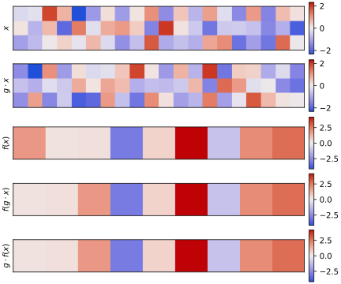
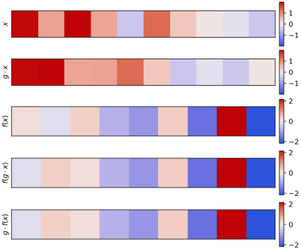
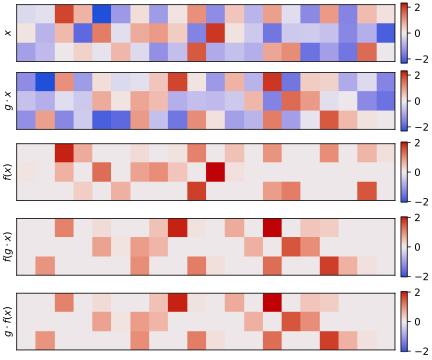
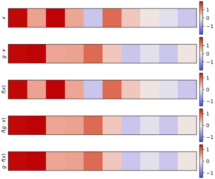
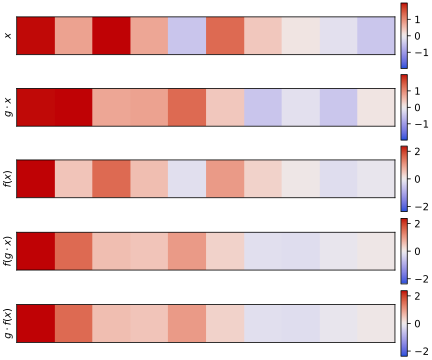
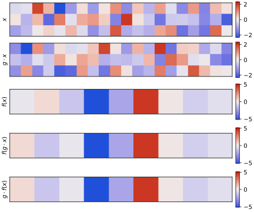
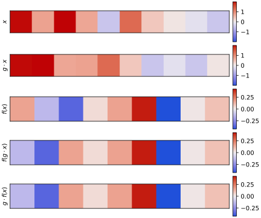

*************************
Check linear equivariance
*************************

2023/05/27:

For the same reasons described in :expt:`2`, I want to manually confirm that 
the predictions made by the linear layers of the context encoder module 
maintain equivariance.  The desired behavior here is a bit more complicated 
than it was for the CNNs, because the context encoder makes two predictions: a 
translation and a rotation.  The translation should be equivariant w.r.t.  
rotations, but the rotation should be invariant.

Results
=======
In all of the plots that follow:

- :math:`x` is the original input.
- :math:`g \cdot x` is the rotated input.
- :math:`f(x)` is the result of applying the module in question to the original 
  input.
- :math:`f(g \cdot x)` is the result of applying the module in question to the 
  rotated input.
- :math:`g \cdot f(x)` is the result of applying the module to the original 
  input, then subsequently rotating it.

In the linear and 2-layer MLP sections, the output vectors have 9 dimensions.  
The first three specify a translation, and should be equivariant w.r.t.  
rotations.  The remaining dimensions specify a rotation, and should be 
*invariant* w.r.t. rotations.

Software versions
-----------------
- escnn: ``1467ccc082553b8715591f1ad58985d5aff08a43``

Linear
------
Icosahedral:

- The translations are equivariant and the rotations are invariant.

- The inputs are 60-dimensional, because the icosahedral group has 60 members.

SO(3):

- The translations are equivariant and the rotations are invariant.

- The inputs are 10-dimensional, because there is one 1D frequency-0 irrep and 
  three 3D frequency-1 irreps.

Nonlinearities
--------------
The plots in this section don't differ in any meaningful way from the 
nonlinearity plots I made in :expt:`2` and :expt:`3` (although I now show 
all 60 icosahedral dimensions instead of just the first).  I did not test the 
nonlinearities on the output fiber, which contains trivial and standard 
representations, because (i) it's not usual to apply nonlinearities to the last 
layer of an MLP and (ii) the only nonlinearities that I think are compatible 
with the standard representation are the norm-based ones, which aren't very 
interesting.

Icosahedral:

SO(3), norm-based nonlinearity:

SO(3), inverse Fourier transform:

- All of these nonlinearities maintain equivariance, as they have previously.

2-layer MLP
-----------
Icosahedral:

   
SO(3):

- The translations are equivariant and the rotations are invariant, as they 
  were for the linear layers alone.

Conclusions
===========
- The linear layers maintain equivariance as expected.

  The only catch is that I have to get rid of all the spatial dimensions (e.g.  
  by pooling or striding) before getting to the linear layer.

- It's possible to simultaneously output a translation and a rotation, even 
  though one is equivariant and the other is invariant.
