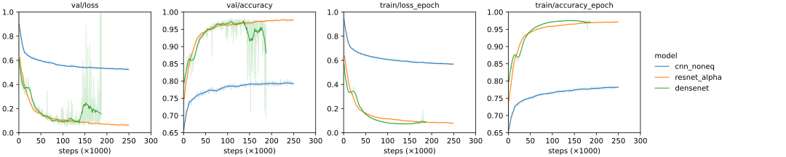

*******************
Compare classifiers
*******************

My models for the transformation prediction task have two CNNs that both feed 
into a single classifier.  Initially, I used equivariant linear layers for the 
classifier.  However, after getting some more experience with the ATOM3D 
datasets, I thought the classifier might work better with regular, 
non-equivariant linear layers:

- This would allow standard nonlinearities like ReLU, which seem more 
  expressive than the equivariant ones.

- The equivariant classifier doesn't actually account for all the symmetries of 
  the problem.  It accounts for when the inputs are rotated, but not for when 
  they're swapped.

- In some sense, the real purpose of the transformation prediction task is to 
  find good weights for the CNNs.  The fact that the final classifier isn't 
  equivariant doesn't affect the fact that the CNNs are, and the weights they 
  learn should still be transferable to other settings.

Some possible downsides:

- The non-equivariant classifier will have more parameters than the equivariant 
  classifier, and probably far more than the equivariant CNN.  This is a little 
  concerning, since it means that most of the learning will be happening in the 
  classifier, which is the non-reusable part.  It also means that differences 
  between the equivariant and non-equivariant classifiers could be simply 
  attributed to the difference in the number of parameters.

Results
=======

- DneseNet achieves >90% accuracy with non-equivariant classifier, as opposed 
  to ≈45% with the equivariant one.

To do
=====
- Test ResNet and CNN.

- Compare to non-equivariant DenseNet/ResNet?

- Make dataset more challenging:

  - Add noise to neighbor position.
  - Increase distance between neighbors.

- Test ATOM3D-optimized parameters.

