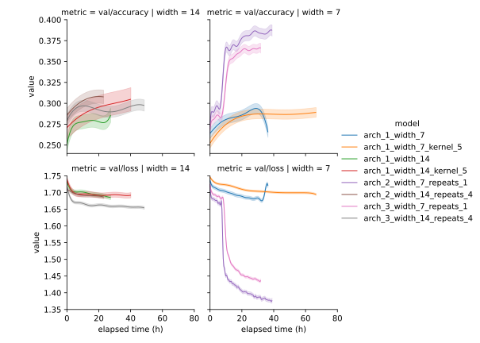

************
Compare CNNs
************

One of the hyperparameters I expect to be the most important is the number of 
channels.  Here I want to learn how adding/removing channels affects training, 
and how many channels I can add before I start running into resource limits.

Refer to :expt:`8` for my first thoughts about how many channels to use.

Considerations
==============

Review of existing CNN architectures
------------------------------------
- This isn't an exhaustive survey of 3D CNNs, but I hope it's enough to be 
  representative of what's out there.  In particular, I tried to include papers 
  from four different areas:

  - Classic 2D CNN architectures.
  - 3D CNNs, as applied to video/LIDAR data.
  - 3D CNNs, as applied to atomic structures.
  - 3D steerable CNNs

  In general, I would say that the atomic structure models were usually the 
  simplest and shallowest.  I suspect that this might reflect that people 
  working on proteins are not as expert when it comes to ML, and that I might 
  prefer to take guidance from the image/video models.  But I'm not sure.

- For comparing to 2D image models, 21³ voxels is comparable to 96² pixels.  
  Models applied to MNIST (16² pixels) or CIFAR-10 (32² pixels) are unlikely to 
  be good comparisons.  But models applied to ImageNet (14M images, 256² 
  pixels, 20K classes) are.

- A very common motif is to double the number of channels after halving the 
  size of the spatial dimensions.  Both 2D and 3D models do this, despite the 
  fact that a 2x reduction in the spatial dimensions is much more significant 
  in 3D and 2D.

- I suspect that it would be a good idea to stick exclusively to 3x3x3 filters.

  - This is an idea from the 2D image processing community.  The idea is that 
    for the same field of view, two 3x3 filters have fewer parameters (18) than 
    one 5x5 filter (25).  This difference is only magnified for 3D filters.

  - But steerable filters have many fewer parameters, because they're linear 
    combinations of spherical harmonics: only a few coefficients are needed to 
    fill in a whole filter.  So maybe I should experiment with bigger filters.

  - Note that [Weiler2018]_ (a steerable CNN) uses 5x5x5 filters for all 
    layers.

- One of my initial impressions from reading all these papers is that I can try 
  going a lot deeper.  With 5 layers, my model is on the shallow end.  I 
  shouldn't be at the point where I have to worry about vanishing gradients or 
  anything like that.  The bigger concern seems to be overfitting, for atomic 
  datasets that are much smaller than ImageNet (14M images).

  I'm not sure if my dataset falls into this category.  It has 10K structures, 
  but 16M origins, along with an infinite number of potential rotations.  
  Obviously there's some redundancy between all these things, but I don't know 
  how to estimate how many "independent" training examples there are.  It 
  doesn't seem crazy to say that I'm on the same order of magnitude as 
  ImageNet, though.

  Note that I'm only using about 1/20th of the PDB, so I could get more data if 
  I wanted to.  Before that, though, I'd want to implement a method for 
  filtering out homology.  (Right now, I have PISCES doing that for me.)

AlexNet: [Krizhevsky2012]_
~~~~~~~~~~~~~~~~~~~~~~~~~~
.. datatable:: cnn_models.xlsx
  :sheet: AlexNet

- The number of channels goes down in the last convolutional layer.
- The image only gets as small as 5x5 before being flattened.

GoogLeNet (Inception): [Szegedy2014]_
~~~~~~~~~~~~~~~~~~~~~~~~~~~~~~~~~~~~~
- Simultaneously calculate 1x1, 3x3, and 5x5 convolutions for the same input, 
  and concatenate all the results for the next layer.  The idea is that the 
  model might get different information from different fields of view, and it 
  would be useful to make all of that information available simultaneously.

- This architecture is too complicated to probe in this experiment, but I do 
  think it's worth looking at in the future.  I'm also curious about a 
  variation that uses dilated convolutions, instead of larger filters, to get 
  a broader but more sparse view of the surroundings.  This strikes me as 
  something similar to what Chroma does with its random connections.

- One caveat is that this might not work as well for 3D inputs, where a much 
  higher proportion of voxels are near an edge and thus subject to padding 
  effects.

VGG-19: [Simonyan2015]_
~~~~~~~~~~~~~~~~~~~~~~~
.. datatable:: cnn_models.xlsx
  :sheet: VGG-19

- The number of channels doubles after each pooling layer, until it reaches 
  512.

  - Note that this means that the number of FLOPs decreases for deeper 
    layers.  The pooling layers reduce the number of pixels by 4x (2x for 
    each dimension), while the number of channels only increases 2x.  This 
    behavior would be even more stark for a 3D model.

- The convolution layers never change the size of their input; only the 
  pooling layers do that.

- This model has 19 layers with no accommodations for vanishing gradients or 
  anything like that, so I can probably afford to have substantially more 
  layers than I currently do.

VoxNet: [Maturana2015b]_
~~~~~~~~~~~~~~~~~~~~~~~~
.. datatable:: cnn_models.xlsx
  :sheet: VoxNet

- General purpose 3D CNN.

- One of the first 3D CNN architectures.

- Very shallow: only 2 convolutional layers.

- The authors discuss the difference between occupied vs. unoccupied vs.  
  unknown voxels.  I wonder if this might also be useful for me, but in a 
  completely different way.  This thing I'm concerned about is padded 
  convolutions (which VoxeNet doesn't use).  I think it might be useful for 
  my model to be able to distinguish between empty space and a padded 
  convolution.  Now that I write this, though, that only matters for the 
  first layer.  I probably don't need to worry about this.

C3D: [Tran2015]_
~~~~~~~~~~~~~~~~
.. datatable:: cnn_models.xlsx
  :sheet: C3D

- Meant for training on video data, so the time dimension is treated 
  differently than the spatial dimensions, most notably by not being the same 
  size.

ResNet: [He2015]_
~~~~~~~~~~~~~~~~~
- Make it easier for the layers to encode the identity transformation, so it 
  doesn't get harder for the model to make predictions as more layers are 
  added.

- I'm not going to add residual modules in this experiment; that's too big of 
  a change.  But I wanted to include this model here, so that this would be a 
  somewhat comprehensive review of relevant architectures.

AtomNet: [Wallach2015]_
~~~~~~~~~~~~~~~~~~~~~~~
.. datatable:: cnn_models.xlsx
  :sheet: AtomNet

- Authors don't fully describe their model architecture, and the code isn't 
  available (probably because this comes from a company).

- Pretty similar to what I'm already doing, though.

ResNeXt: [Xie2017]_
~~~~~~~~~~~~~~~~~~~
- Haven't read closely yet, but seems to be something of a combination of 
  Inception and ResNet.  I'm definitely interested in trying both ResNet and 
  Inception, so this is probably something I'd like to try as well, but not in 
  this experiment.

MobileNet: [Howard2017]_
~~~~~~~~~~~~~~~~~~~~~~~~
.. datatable:: cnn_models.xlsx
  :sheet: MobileNet

- Use depthwise-separable convolutions to dramatically reduce the number of 
  model parameters, at the slight expense of accuracy.

- The reduction in parameters would be even more significant for a 3D model.  
  The loss in accuracy might also be greater, though.

- Like VGG-19, very deep with no accommodations for vanishing gradients.

- Like VGG-19, the number of channels doubles whenever the spatial dimensions 
  are halved.  Also very deep (27 convolutional layers), with no 
  accommodation for vanishing gradients.

[Torng2017]_
~~~~~~~~~~~~
.. datatable:: cnn_models.xlsx
  :sheet: Trong2017

- Predict amino acid identity given molecular context.
- Relatively shallow.
- Doesn't use padding.

GNINA: [Ragoza2017]_
~~~~~~~~~~~~~~~~~~~~
.. datatable:: cnn_models.xlsx
  :sheet: GNINA

- Classify protein/ligand poses as binders/non-binders.
- Use 34 atom type channels, including information on aromaticity and 
  H-bonding.
- The authors chose a shallow model (only 3 layers), but they evaluated models 
  with as many as 8 layers, and found that 3 gave the best performance.
- The authors aren't very clear about the dimensions of each layer, but I think 
  I worked everything out correctly.

DeepSite: [Jimenez2017]_
~~~~~~~~~~~~~~~~~~~~~~~~
.. datatable:: cnn_models.xlsx
  :sheet: DeepSite

- Very large convolutional kernels.

- The paper doesn't describe the spatial dimensions of each layer.  I 
  calculated the values in the above table by hand, based on the source code in 
  the supplement.  The values don't really make sense, though.  Both max 
  pooling layers are applied to odd-sized dimensions, which means they end up 
  discarding information.  The last max pooling layer discards a lot of 
  information, since its a 2x2x2 filter applied to a 3x3x3 layer.  This is all 
  to say, I'm not sure the above values are right.

DenseNet: [Huang2018]_
~~~~~~~~~~~~~~~~~~~~~~
- Not considering DenseNets in this experiment, but including the reference for 
  completeness.

- DenseNets are relatively narrow, which could be particularly good for 
  steerable CNNs, where each "channel" is much bigger than a normal channel.  I 
  actually really like the idea of using DenseNets.

I3D: [Carreira2018]_
~~~~~~~~~~~~~~~~~~~~
- 3D Inception
- Not considering Inception modules in this experiment, but including the 
  reference for completeness.

[Hara2018]_
~~~~~~~~~~~
- Very deep 3D ResNets
- Not considering ResNets in this experiment, but including the reference for 
  completeness.

[Derevyanko2018]_
~~~~~~~~~~~~~~~~~
.. datatable:: cnn_models.xlsx
  :sheet: Derevyanko2018

- Very large input: 120³ voxels, with 1Å cell size

se3cnn: [Weiler2018]_
~~~~~~~~~~~~~~~~~~~~~
- 3D steerable CNNs

  - Not the same framework that I'm using, but the same concepts.

  - Steerable CNNs have many fewer parameters than "normal" CNNs with the same 
    width.  This is because the convolutional kernels are linear combinations 
    of spherical harmonics, so only a few coefficients are needed to fill in a 
    whole kernel.

- 3D model classification:

  .. datatable:: cnn_models.xlsx
    :sheet: Weiler2018

  - 142K parameters.

- Amino acid environments

  - Uses same architecture and dataset as [Torng2017]_, except with equivariant 
    convolutions instead of normal convolutions.

  - Since equivariant convolutional filters have fewer parameters per channel, 
    the authors chose to give their model a *field* for each channel in the 
    original model.  It's not exactly clear from the paper, but I presume that 
    each field is one of the first three SO(3) irreps, meaning that each one 
    has a dimension between 1-5.  Despite this, the final model still ends up 
    with only half as many parameters as the original model.  The intermediate 
    tensors must be bigger, though.

  - 32.6M parameters.

- CATH protein fold identification

  - 50x50x50 input

  - Baseline CNN:
    
    - Similar to ResNet-34, but with a third dimension and half the number of 
      channels at each layer.

    - 15M parameters

  - Equivariant CNN: 

    - Unlike the amino acid task, use exact same number of channels as the 
      baseline model.  This means we end up with only 144K parameters, 100x 
      fewer than the baseline.

    - Use the first 4 SO(3) irreps, in equal proportion, in each layer.

Emap2sec: [Maddhuri2019]_
~~~~~~~~~~~~~~~~~~~~~~~~~
.. datatable:: cnn_models.xlsx
  :sheet: Emap2sec

- Really hard to figure out what this model actually is.   I wouldn't take much 
  from this other than the fact that there are 5 convolutions on a pretty small 
  grid.

Ornate: [Pages2019]_
~~~~~~~~~~~~~~~~~~~~
.. datatable:: cnn_models.xlsx
  :sheet: Emap2sec

- Huge number of input channels, compressed using a 1x1x1 convolution.  Similar 
  to bottlenecking.
- Very few channels.  The widest layer only has 30 channels, and the model 
  actually gets narrower from that point on.

DenseCPD: [Qi2020]_
~~~~~~~~~~~~~~~~~~~
- DenseNet applied to protein backbone data.

  - 3 DenseBlocks, each with 6 bottlenecked convolutions
  - Compression ratio of 0.5
  - Growth rates of 15-35

- Not considering DenseNets in this experiment, but including the reference for 
  completeness.

ProDCoNN: [Zhang2020]_
~~~~~~~~~~~~~~~~~~~~~~
- An somewhat Inception-style 3D CNN applied to protein design.

- Very shallow: only 2 convolutional layers.

- Not considering Inception modules in this experiment, but including the 
  reference for completeness.

DOVE: [Wang2020]_
~~~~~~~~~~~~~~~~~
.. datatable:: cnn_models.xlsx
  :sheet: DOVE

- Identify near-native protein/protein binding poses, from a library of decoys 
  (e.g. generated by some docking algorithm).

- Shallow: only 3 convolutional layers

[Kopuklu2021]_
~~~~~~~~~~~~~~
- 3D MobileNet
- Not considering depthwise-separable convolutions in this experiment, but 
  including the reference for completeness.

escnn: [Cesa2022]_
~~~~~~~~~~~~~~~~~~
- This is obviously an important point of comparison, because it's using the 
  exact same framework I am.

- The concept of a channel is more fuzzy.  I think it makes the most sense to 
  think of each representation as it's own channel, since all the features 
  transformed by one representation get transformed together.  Of course, these 
  "channels" can be more expressive than the channels of a traditional CNN, so 
  you might not need as many.

- [Cesa2022]_ seem to use a ResNet architecture for all of their 3D CNN 
  experiments, and I'm not considering ResNet architectures in this experiment.  

  That said, I think it's still worth looking at the width of network.  There 
  are two kinds of width in the ResNet architecture: between the residual 
  blocks and within the residual blocks.  I'll comment on both:

  Between residual blocks:

  - Representations:
    
    - 1D: $\rho_0$
    - 3D: $\rho_1$
    - 5D: $\rho_2$
    - 9D: $\rho_1 \otimes \rho_1$
    - 27D: $\rho_1 \otimes \rho_1 \otimes \rho_1$

  - 33x33x33x39: 9 representations (1D, 3D, 9D)
  - 17x17x17x80: 8 representations (1D, 3D, 9D, 27D)
  - 9x9x9x240: 24 representations (1D, 3D, 9D, 27D)
  - 5x5x5x240: 48 representations (1D, 3D, 9D, 27D)
  - 3x3x3x320: 32 representations (1D, 3D, 9D, 27D)
  - 1x1x1x1152: 384 representations (1D, 3D, 5D)

  Within residual blocks:

  - Spectral regular representation:

    - $\rho_0 \oplus \rho_1^{\oplus 3} \oplus \rho_2^{\oplus 5}$
    - Always with band limit of 2
    - The band limit is chosen based on number of inverse Fourier samples, 
      which in this instantiation of the model is just 96 for all layers.
  
  - 33x33x33x70: 18 irreps (2 spectral regular representations)
  - 17x17x17x175: 45 irreps (5 spectral regular representations)
  - 9x9x9x175: 45 irreps (5 spectral regular representations)
  - 5x5x5x350: 90 irreps (10 spectral regular representations)

How many protein structural motifs are there?
---------------------------------------------
- Previous studies have attempted to create structural "alphabets", with the 
  goal of describing as much protein structure as possible with the fewest 
  "letters".

- This work can inform the number channels I might want, when the filters are 
  about the same size as the alphabet members.

- Note that my model doesn't necessarily need a separate channel for each 
  "letter".  The letters may not be completely orthogonal, i.e. it may be 
  possible to represent each letter using a linear combination of a smaller 
  number of channels.

- TERMs:

  - 1-10 segments of 5 contiguous residues, chosen to cover the PDB as 
    parsimoniously as possible.

  - The number of TERMs need to cover a given fraction of the PDB grows 
    exponentially.

    - 625 TERMs: just over 50% of PDB

  - New structures still contain previously unseen TERMs, so the full set of 
    TERMS is not yet complete.  That said, the first ≈9000 TERMs (which 
    collectively cover 70% of the PDB) seem to be unaffected by new 
    structures.

  - TERMs aren't fixed size, but mostly fit in boxes with ≈10-20Å sides.  

    .. figure:: get_term_bbox_dims.svg
    
    - Note that that's roughly the same size as my entire field of view for 
      this experiment (21 voxels × 0.75Å = 15.75Å).  I think this lends some 
      additional credence to the idea of using TERMs as a guideline for the 
      number of channels in my deepest convolutional layer.

  - Overall, I think this suggests that something like 500-1000 channels in the 
    final layer would be ideal.

- BriX database:

  - Contiguous regions of backbone structure, 4-14 residues in length, 
    clustered hierarchically by RMSD.

  - 1000-3000 classes per length.

  - What can I take away in terms of the number of channels I should have?

    - Can't add up the number of classes for all segment lengths, because there 
      will be a lot of redundancy (e.g. a 8-residue α-helices is composed of 
      4-residue α-helices).  Instead, probably just have to pick a class that's 
      about the right size and consider it.

    - Probably the best thing is to look at the number of classes for one 
      specific length that roughly fits the field of view that I care about.  
      Contiguous backbone segments don't necessarily fit well in a cubical 
      field of view at all, but the number of classes doesn't vary wildly as a 
      function of segment length, so overall I don't think it matters which 
      length I pick.

    - That suggests something on the order of 1000 channels, but I'd take this 
      with a grain of salt.  The TERM approach seems much better aligned with 
      what I'm trying to represent.

Should my final layer be a single voxel?
----------------------------------------
- This doesn't need to be the case; I could flatten any remaining spatial 
  dimensions just before the linear layers (i.e. stack the channels for each 
  voxel on top of each other).

  .. update:: 2024/01/12

    Note that this kind of flattening is not equivariant.

- My field of view is similar to the size of most TERMs, though, suggesting 
  that each field of view should only contain a single "entity".

What exactly is a "channel" in an equivariant network?
------------------------------------------------------
- Representations

  - These define the groups of features that convolutions act on.  For example:

    - The frequency = 1 SO(3) irrep $\rho_1$ is 3D.  So a convolution on this 
      representation will always mix together the 3 corresponding feature 
      vector elements, but will only mix in other feature vector elements 
      depending on the specific learned parameters.

  - Representations used for this purpose are typically 1-9D.

    - This means that each representation (except the 1D ones) encodes much 
      more information than a standard channel.

  - It's common to use irreps, but it's also possible to use reducible 
    representations:

    - $\rho_1 \otimes \rho_1$: This is a 9D representation (because $\rho_1$ is 
      3D) that reduces into $\rho_1$ and $\rho_2$.  The escnn SE(3) CNN example 
      uses this representation.

    - The irreps that a reducible representation decomposes into are important.  
      I don't exactly understand why, but equivariant linear transformations 
      can only exist between vector spaces that share irreps (or something like 
      that).  So this decomposition affects how features in one layer will mix 
      with those in another.  This is related to Shur's lemma, if you want to 
      know more.

  - The number of learned parameters is much smaller than the dimension on the 
    kernels themselves.

    - This is because each kernel is a linear combination of basis functions 
      (e.g. spherical harmonics), so only a few coefficients are needed to fill 
      in a whole kernel.

    - That said, the full kernel does need to be expanded within the layer, so 
      we still need enough memory to hold all of it (maybe temporarily, 
      depending on how back-propagation works).

- I'm only using "spectral regular representations", currently.

  - These are the representations that are compatible with Fourier 
    nonlinearities.

  - These are direct sums of band-limited irreps, where the multiplicity of 
    each irrep is equal to its dimension.

  - Based on the other steerable CNNs I've read about, band limits of 2-3 seem 
    reasonable for these representations.  I'm currently using a band limit of 
    2, and that's not something I'm going to optimize in this experiment, but 
    it may be an important hyperparameter.
    
  - Band limit 2:

    - $\rho_0 \oplus \rho_1^{\oplus 3} \oplus \rho_2^{\oplus 5}$
    - 9 irreps
    - 35 physical channels

  - Band limit 3:

    - $\rho_0 \oplus \rho_1^{\oplus 3} \oplus \rho_2^{\oplus 5} \oplus \rho_3^{\oplus 7}$
    - 16 irreps
    - 84 physical channels

- How many representations/channels?

  - Assuming band-limit=2 for now.  I'll experiment with higher limits later.

  - I think it's reasonable to try to make the number of physical channels as 
    close as possible to a power-of-2, given that the number also has to be a 
    multiple of 35.

    -   64:   1 × 35 =   35
    -  128:   3 × 35 =  105
    -  256:   7 × 35 =  245
    -  512:  14 × 35 =  490
    - 1024:  29 × 35 = 1015
    - 2048:  58 × 35 = 2030
    - 4096: 117 × 35 = 4095
    - 8192: 234 × 35 = 8190

How much memory do I need?
--------------------------
- Memory requirements:

  - Learnable parameters:

    - Equivariant convolutions require fewer parameters than normal 
      convolutions, because each filter is constructed from a lesser number of 
      coefficients.

    - Most of the parameters are probably in the linear layers, so I might 
      think about trying to make those layers smaller.

  - Persistent tensors:

    - Kernel basis sets, e.g. spherical harmonics

      - This is probably negligible, since the basis function aren't that big 
        to begin with, and they can be shared.

  - Intermediate matrices:

    - Convolutional filters

      - Largest in the latest layers, because the spatial dimensions are always 
        the same, but each kernel needs input and output channel dimensions.

    - Feature fields for each layer

      - Largest in the earliest layers, because the spatial dimensions shrink 
        faster than the channel dimensions grow.

    - Fourier transform, inverse Fourier transform

      - I'm not sure exactly how/if these matrices are cached.  The cached 
        version might not depend on the number of channels, definitely wouldn't 
        depend on the spatial dimensions, and might be shared between layers.  
        So if there is a cache, I expect it to be small.

      - The tensor that is actually used to perform the FT/IFT could be fairly 
        big, because it should include all the spatial/channel dimensions plus 
        a grid dimension (which will usually have ≈100 elements).

      - Like the feature fields, this would be largest in the earliest layers.

    - Gradients

- I expect that the hyperparameter that will have the biggest effect on memory 
  usage will be the width of the final convolutional layer, mostly because this 
  determines the size of the linear layers.

- The intermediate convolution filters and the Fourier transform matrices for 
  the linear layers seem to be using most of the memory.  But note that the 
  filters are biggest in the later layers (where there are the most channels) 

Which channels to test?
-----------------------

Architecture #0: Initial model
~~~~~~~~~~~~~~~~~~~~~~~~~~~~~~
- Parameters: 1.2M
- Speed: 6 minibatch/sec
- VRAM:

    - Forward/backward: 0.3 GB
    - Convolution: 0.3 GB
    - Fourier: 0.1 GB

Architecture #1: No down-sampling
~~~~~~~~~~~~~~~~~~~~~~~~~~~~~~~~~
- 10 3x3x3 unpadded convolutions

  - Still shallower than VGG

  - None of the CNN models I looked at had more than 4 consecutive 
    convolutions with no downsampling.  But sometimes downsampling is 
    achieved by stride=2 convolutions, which doesn't seem that different from 
    what I'm doing.

- Scale number of representations in proportion to (inverse) relative change 
  in side length.

- Width=14, Kernel=3x3x3

  - Parameters: 7.2M
  - Speed: 2 sec/minibatch
  - VRAM:

    - Forward/backward: 5.8 GB [1]_
    - Convolution: 1.8 GB
    - Fourier: 1.2 GB

- Width=7, Kernel=3x3x3

  - Parameters: 4.0M
  - Speed: 2 minibatch/sec
  - VRAM:

    - Forward/backward: 2.9 GB [1]_
    - Convolution: 0.9 GB
    - Fourier: 0.6 GB

- Width=14, Kernel=5x5x5

  - Parameters: 5.5M
  - Speed: 3 sec/minibatch
  - VRAM:

    - Forward/backward: 2.3 GB [1]_
    - Convolution: 4.2 GB
    - Fourier: 0.8 GB

- Width=7, Kernel=5x5x5

  - Parameters: 3.5M
  - Speed: 1 sec/minibatch
  - VRAM:

    - Forward/backward: 1.1 GB [1]_
    - Convolution: 2.1 GB
    - Fourier: 0.4 GB

Architecture #2: Padded downsampling/VGG
~~~~~~~~~~~~~~~~~~~~~~~~~~~~~~~~~~~~~~~~
- Although my initial goal with architecture was to do something like VGG, the 
  thing that ended up being unique about this architecture is the padded 
  down-sampling convolutions.

- The goal is to do multiple convolutions for each input size (i.e. padding = 
  1), to allow for more layers than would be possible if we shrank the 
  (relatively small) input each time.

- This also has the effect of keeping the feature field large, which I think 
  might help with detecting spatial features.

- It's a bit tricky to find a set of spatial dimensions that work for this:

  - I thought about shrinking the voxel size to change the input dimensions 
    without changing the size of the actual views.  (I thought this would be 
    better for making fair comparisons than the alternative.)  But after 
    looking at 0.5Å voxels in pymol, I think a 0.75Å voxel is about as small 
    as you can get while still detecting bonds with 3x3x3 filters.  So I 
    decided to keep the input exactly the same.

  - I want the first layer to be a non-padded convolution, because I want a 
    zero-vector to mean "empty space", not "out of bounds".  In subsequent 
    layers, though, I aim for as many padded convolutions as possible.

  - The architecture I came up revolves around pad=1, stride=2 convolutions 
    to go from 17x17x17 to 9x9x9 to 5x5x5.

  - I use two unpadded convolutions to get from the original input size of 
    21x21x21 down to 17x17x17, and also to get from 5x5x5 down to the final 
    output size of 1x1x1.

- Channels:

  - For the bigger network, double on downsampling only.
  - This differs from the more principled strategy I used for #1, where the 
    number of channel increases in relation to the volume of the spatial 
    dimensions.
  - But this mimics VGG, and reduces the total number of parameters to a 
    manageable number.

- Width=14, Repeats=4

  - Parameters: 3.2M
  - Speed: 2 sec/minibatch
  - VRAM:

    - Forward/backward: 7.4 GB [1]_
    - Convolution: 0.4 GB
    - Fourier: 1.2 GB

- Width=7, Repeats=1

  - Parameters: 1.7M
  - Speed: 3 minibatch/sec
  - VRAM:

    - Forward/backward: 1.8 GB [1]_
    - Convolution: 0.4 GB
    - Fourier: 0.6 GB

Architecture #3: As shallow as possible
~~~~~~~~~~~~~~~~~~~~~~~~~~~~~~~~~~~~~~~
- A goal for this architecture is to run about as fast as the original 
  architecture I was experimenting with, while also being more in-line with my 
  current ideas for how a network should be organized.
  
  Subsequently I realized that this architecture is not so different from #2, 
  so I created deep/shallow variants (of both) to allow for more direct 
  comparisons.

- There's a limit to how shallow a network can be, while (i) starting 
  21x21x21, (ii) ending 1x1x1, (iii) only using 3x3x3 convolutions, and (iv) 
  not downsampling in the first layer.  The following is the best I could 
  come up with:

  ===========  ======  ===  ===========
  Layer        Stride  Pad  Output size
  ===========  ======  ===  ===========
  Input             1    0           21
  Convolution       1    0           19
  Convolution       2    0            9
  Convolution       1    0            7
  Convolution       2    0            3
  Convolution       1    0            1
  ===========  ======  ===  ===========

- Note that I could think about using 5x5x5 filters; that might allow 
  different solutions.

- Channels:

  - I'm going to try wide and narrow version of this architecture.

  - Narrow/shallow version:
    
    - The goal is to run really fast.
      
    - Start at 7 channels, and increase in proportion to (inverse) spatial 
      dimension size (i.e. cube root of volume).
      
    - I won't exceed 58 spectral regular representations.  That corresponds to 
      522 irreps (a.k.a.  "logical channels"), which is about as many as any 
      normal CNN uses anyways.  

  - Wide/deep version:

    - Double on each downsample: see #2 for more explanation.

- Width=14, Repeats=4

  - Parameters: 2.7M
  - Speed: 2 sec/minibatch
  - VRAM:

    - Forward/backward: 9.9 GB [1]_
    - Convolution: 0.4 GB
    - Fourier: 1.2 GB

- Width=7, Repeats=1

  - Parameters: 1.4M
  - Speed: 5 minibatch/sec
  - VRAM:

    - Forward/backward: 1.2 GB [1]_
    - Convolution: 0.4 GB
    - Fourier: 0.6 GB

Results
=======
- The models didn't all run for the 500 epochs I intended them to, but they did 
  all run for a pretty significant amount of time:

  .. datatable:: epochs.xlsx

  - I think there's enough data to make comparisons with.

  - I haven't looked that closely into what the problems were.  There are 11 
    log files, when there should only be 8, so there's some messiness to 
    account for.

  - `arch_3_width_7_repeats_1` seems to have failed with an SQLite error.  If I 
    see the same error again, I'll look into it, but for now I'll assume it was 
    a fluke, or something I already fixed::

      Traceback (most recent call last):
        File "/home/kbk8/research/software/projects/atompaint/atompaint/transform_pred/datasets/classification.py", line 40, in __getitem__
          tag, _, origins, atoms_i = self.origin_sampler.sample(rng)
        File "/home/kbk8/research/software/projects/atompaint/atompaint/transform_pred/datasets/origins.py", line 211, in sample
          tag_id, *origin_a = cur.execute(self.select_origin_a, (i,)).fetchone()
      TypeError: cannot unpack non-iterable NoneType object

  - `arch_1_width_7_kernel_5` seems to have run out of memory, although that's 
    surprising, since its a pretty small model.

  - A number of the other jobs seem to have died after restoring the first 
    checkpoint, without leaving an error message.  Not sure what that means.

- Pooling steps seem to be important.

  - The lack of pooling is the defining feature of architecture #1, which 
    performed significantly worse than architectures #2 and #3.

  - Although architectures #2 and #3 seems to benefit greatly from an automatic 
    change in learning rate, they're outperforming architecture #1 even before 
    that.

  - I don't know why `arch_1_width_7` suddenly got significantly worse right at 
    the end.  Looking at the raw data, I'm suspicious that maybe the wrong 
    checkpoint got loaded somehow?

- Very wide/deep networks are not helpful.

  - Width and depth are not tested separately here, since the widest networks 
    are also the deepest, so I can't say whether it's width or depth that is 
    detrimental.

  - The issue isn't necessarily that the wide/deep networks are worse; it's 
    that they're much slower.  The plots show accuracy/loss as a function of 
    wall clock time, but you can see in the spreadsheet above that the 
    wide/deep networks got 5-10x fewer steps in a comparable amount of time as 
    the narrow/shallow ones.  That said, it's clear that the decreased speed is 
    not compensated by an increased rate of learning.

- Architecture #2 may be slightly better than architecture #3.

  - I don't know for sure that this difference is significant, after just one 
    training run.
  
  - Possible rationales:

    - Larger field of view: The first strided convolution in architecture #3 is 
      the second layer, while the first strided convolution in architecture #2 
      is the third layer.  This means that architecture #2 has a larger field 
      of view for longer, which has been mentioned as a possibly helpful thing.

    - Padded convolutions: Architecture #3 doesn't use padded convolutions, as 
      it's trying to get to 1x1x1 as fast as possible.  Architecture #2 does.

    - Number of channels: The number of channels in both architectures are 
      similar, but it may be significant that the number of channels doesn't 
      increase as quickly in architecture #2 as in architecture #3.  I think 
      there are two reasons for this: (i) architecture #2 has an extra layer, 
      so there's more time to slowly add channels, and (ii) the downsampling 
      steps are padded convolutions, so they don't decrease the spatial 
      dimensions as much, and therefore don't need to increase the channels as 
      much to compensate.

  - It won't be easy to disentangle the field of view/padded convolution 
    rationales, because changing either of those variables would require 
    changing the whole architecture.  But it might be worth trying some 
    variants with different numbers of layers.

.. [1] This is the estimate made by ``torchinfo``.  It's not accounting for the 
   temporary buffers allocated by `R3Conv` and `FourierPointwise`, which can be 
   quite large.

