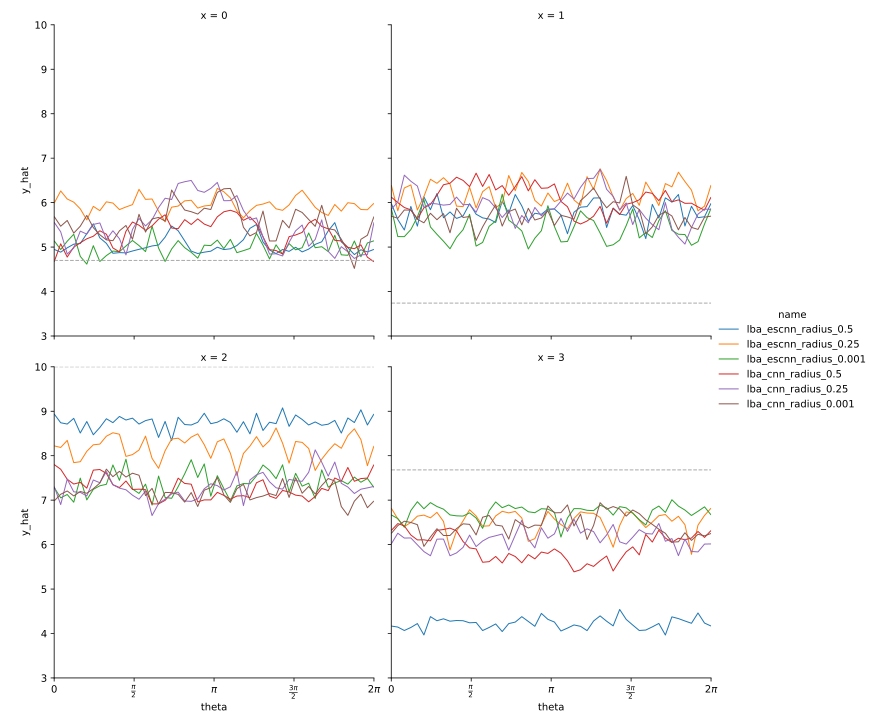

********************
Compare voxelization
********************

Methods that apply CNNs to atomic systems vary in how they voxelize the atoms.  
I'm aware of three different approaches:

- Atoms as points: The entire density for each atom is assigned to whichever 
  voxel contains the center of the atom.  This is the simplest and fastest 
  approach, but I worry that it might decrease equivariance. 

- Atoms as spheres: I actually haven't seen any other paper take this approach, 
  probably because calculating sphere/cube overlaps is a surprisingly hard 
  problem.  The advantages of this approach are that: (i) it's possible to 
  recover the exact coordinates of each atom, as a weighted average of the 
  voxel centers, (ii) the representation changes smoothly as the input 
  coordinates are rotated, which should improve equivariance, and (iii) atoms 
  naturally are finite in radius (see below).

- Atoms as Gaussian distributions: Atom density is assigned in proportion to a 
  Gaussian distribution centered on the atom, with some arbitrary radial 
  cutoff.  I don't think there's any physical reason to think of atoms like 
  this, so I view this as an approximation of the "atoms as spheres" approach 
  described above.

When comparisons have been made between the first and third approaches, no 
significant difference has been found.  However, I want to make this comparison 
myself, since I think equivariance could play an important role.

LBA Results
===========
Instead of testing true point atoms, I decided it would be easier and more 
informative to test spherical atoms with a range of different radii.  I used a 
radius of 0.001 to mimic point atoms.

- Comparing different radii: no significant difference

  - This isn't a surprising result, as described in the intro.

  - That said, the validation results are very noisy.  I think this would make 
    it hard to distinguish all but the most significant differences.  In other 
    words, I think the LBA dataset is to small to observe subtle differences.

- Comparing the CNN and ESCNN models: the validation results are the same, but 
  the ESCNN models perform better on the training data.

  - This may be a sign that the ESCNN models are overfit.  That would be a bit 
    counter-intuitive, since the ESCNN models have fewer parameters than the 
    CNN models (although in both cases most of the parameters are in the MLP, I 
    think).

  - This may also be a sign that differences would be visible with a bigger 
    validation set.

  Each plot shows the predictions made by each model on a single input, as a 
  function of the rotation of that input around the z-axis.  Perfect rotational 
  invariance would be represented as a straight, horizontal line.

- The ESCNN models are slightly more invariance than the CNN models, but the 
  difference isn't as big as I was hoping for.

  - Note that the ESCNN traces often have a pattern that repeats four times.  
    This is because the model is most invariant w.r.t. grid-aligned rotations.

  - This 4-fold symmetry makes the ESCNN models more invariant overall, as the 
    CNN models tend to meander more as a function of $\theta$.

  - It'll be interesting to see how different layers affect invariance error, 
    although that's outside the scope of this experiment.  

SMP Results
===========
