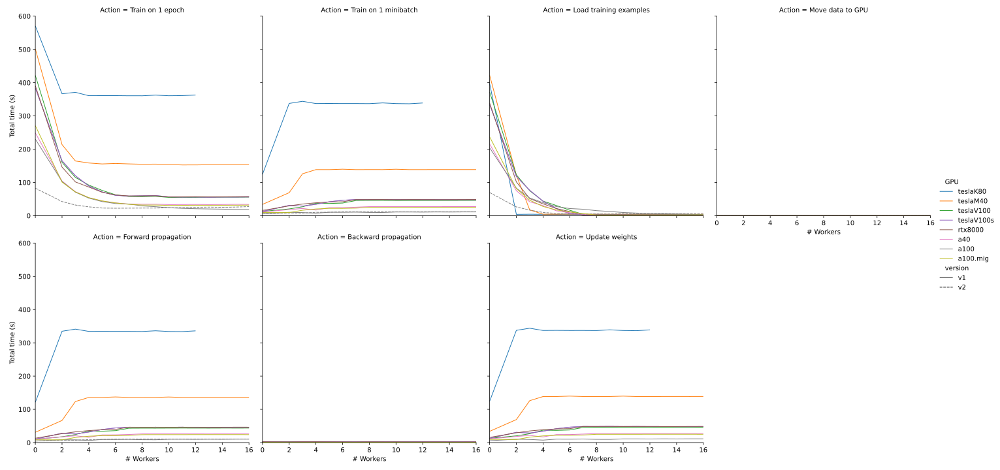

*************
Find best GPU
*************

While doing other experiments with my model, I've noticed that the performance 
can vary significantly depending on which node I'm allocated.  Here, I want to 
take a comprehensive look at all of the GPUs available on O2 and figure out 
which one gives the best performance.

GPU Basics
==========
- CUDA cores:

  - Not sure, but I think each CUDA core is basically a CPU with a limited 
    instruction set, and that is constrained to operate in parallel with a 
    bunch of other CUDA cores.

  - In terms of matrix math, each CUDA core can perform a single multiplication 
    in each clock cycle.

- Tensor cores:

  - Good introduction: https://developer.nvidia.com/blog/programming-tensor-cores-cuda-9/

  - Each cores performs a 4x4 matrix multiplication and adds the result to 
    another 4x4 matrix, all in a single clock cycle.

  - Ampere devices can use tensor cores for FP32 matrices, although they carry 
    out the multiplication in the lower precision TF32 format.  The addition is 
    full FP32 precision.

  - Volta devices can only use tensor cores on FP16 matrices.

https://stackoverflow.com/questions/47335027/what-is-the-difference-between-cuda-vs-tensor-cores

GPU Comparisons
===============
.. datatable:: gpu_specs.xlsx

- I included the 4x4 FP16 FMA speeds because I might eventually decide to use 
  mixed precision.  Currently, though, only the FP32 speeds are relevant to me.

- I'm not sure if O2 has the PCIe of NVLink version of the Tesla V100, but the 
  difference is probably imperceptible.

- Very detailed description of the `Ampere architecture`__.

  __ https://developer.nvidia.com/blog/nvidia-ampere-architecture-in-depth/

- A40 and A100 have the same "Ampere" architecture, but the A40 is `meant for 
  visualization`__.  (Note that only the A40 has ray-tracing cores.))

  __ https://www.microway.com/knowledge-center-articles/in-depth-comparison-of-nvidia-ampere-gpu-accelerators/

- The "Ampere" architecture (A40, A100) is considered the successor to the 
  "Volta" architecture (V100, V100s, RTX 8000).

- The most recent architecture (2022) is "Hopper", but O2 doesn't have any 
  Hopper devices yet.

Mixed Precision
===============
https://pytorch.org/blog/what-every-user-should-know-about-mixed-precision-training-in-pytorch/ 

- FP32: Unlikely to need full single precision for each operation.

- TF32: Only implemented by Ampere devices.  The loss in precision for this 
  format (10 mantissa bits vs. 24) is rarely important, and the speed-up is 
  significant.

  - I'm already doing this.  Convolutions use TF32 by default, and I've 
    manually enabled it for matrix multiplication.

- FP16/BF16:

  - More likely to have problems converging.
  - Don't think I should do this for a first pass.  Once I have a baseline 
    accuracy to compare to, I can try both and see if either gives better 
    speeds without sacrificing accuracy.
  - Can enable for only parts of the model.  "Linear algebra" routines tend to 
    be more sensitive.  Not sure if convolution counts as a "linear algebra" 
    routine.

Results
=======

- The A100 is the fastest GPU.

  - Which GPUs should I request when submitting jobs?

    - The K80 and M40 are too slow; I have to exclude them.

    - The Volta devices and the A40 might be worth including, if I find that 
      it's taking a long to to get off the queue.

    - I suspect that I've been having a pretty easy time getting on the A100 so 
      far because I've been requesting such short amounts of time.  I think 
      that makes it easy for the scheduler to fit me in.  It might get harder 
      once I start submitting really long jobs.

  - The A100 still spends 5% of its time just loading the inputs, which is 
    insane given how much I've optimized that code and given that 16 data 
    loader processes are running.  Still, 5% is pretty good; running more data 
    loader processes would not be likely to speed things up significantly.

  - The A100.mig is slower than the A100, and comparable to the A40.  That's 
    not what I expected, and I'm not sure what the reason is.

- FP32 math on the GPU is the bottleneck.

  - Forward propagation is the slowest step.  This occurs entirely on the GPU, 
    and is exclusively matrix math.

  - Overall performance tracks with the published FP32 performance of the 
    graphics cards.

  - I could get another 2x performance boost by switching to half/mixed 
    precision.  But want to start with single precision.

- I'm suspicious of how closely the "forward propagation" and "update weight" 
  times track each other.  They must be measuring overlapping times, since 
  together they would add up to more than the minibatch training time.

  I read the lightning source code, and convinced myself that these were not 
  overlapping times, but I must be wrong somehow.  I should take another look 
  at the code.
