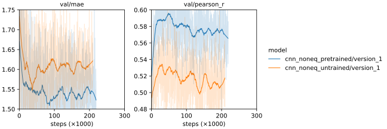

*********
First try
*********

The first I want to try is fine tuning a basic CNN model on the ligand-binding 
affinity dataset.

.. update:: 2024/06/28

  I didn't take notes on this experiment at the time I ran it.  I can't fathom 
  why, because this was one of my best results at that point; you'd think I'd 
  have wanted to write about it.  Regardless, I wrote some notes today so that 
  my notebook would be complete, but its possible that I've forgotten some 
  nuances in the meantime.

Results
=======

- For a CNN inspired by [Townshend2022]_, pretraining improves the model 
  significantly.

- I also tried pretraining the alpha equivariant ResNet in this experiment, but 
  in that context the pretraining wasn't helpful.
