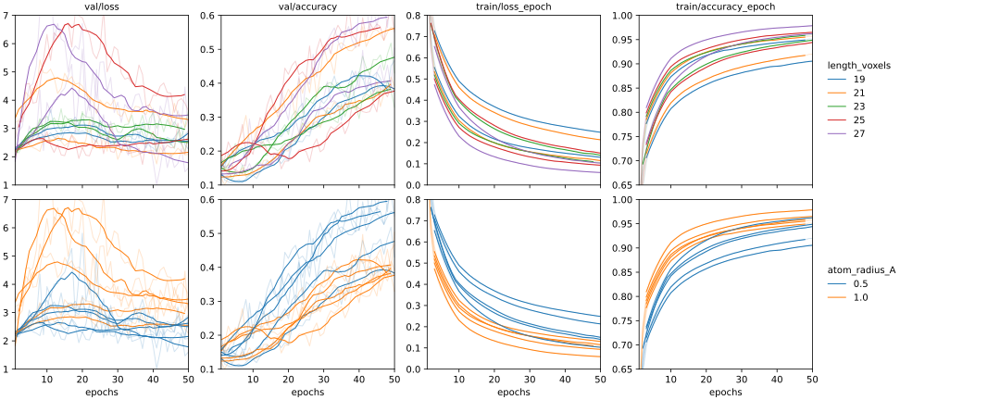

***********************
Train with large images
***********************

In :expt:`73`, I tried simultaneously increasing the size of the image and 
adding noise to the location of the second view.  The result was that the model 
could not learn the data.  Here I will investigate the effect of increasing the 
size of the image to 24Å, without adding any noise.

Results
=======

- The atomic radius has a significant effect on the results.

  - The smaller radius (0.5Å) gives worse results on the training set, but 
    better results on the validation set.

- The size of the image (in voxels) does not have a strong effect.

  - Larger images give slightly better results on the training set, but there's 
    no clear difference on the validation set.
    
  - Only the 19 and 27 voxel images have all the convolutions line up with the 
    dimensions of the image.  

  - Note that the physical dimensions are the same for every image: 24Å.  So 
    the questions being asked here are (i) are higher resolutions helpful and 
    (ii) does it matter if the convolutions line up with their inputs.  

- Compared to :expt:`70` (16Å images), these models have similar validation 
  accuracy but much higher training accuracy.  I can't really think of any 
  reasons why bigger images would make it easier to memorize the training set.
  
- Validation accuracy is still improving at the end of the training run, so I 
  expect that it hasn't yet reached its maximum.

Discussion
==========
- In :expt:`73`, I made the atom radius very large (1.5Å) because I thought it 
  would help normalize the image a bit.  Based on the results here, that is 
  probably why the model didn't work well.
