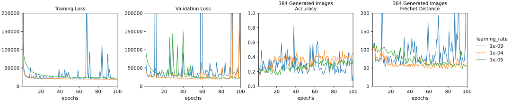

**********************
Compare learning rates
**********************

In :expt:`101`, the model was not able to consistently improve during training.  
The most intuitive reason for this is that the learning rate is set too high; 
the model is making steps that are too big, and as a result fails to stay in 
local minima.  Here, I'm going to see if lowering the learning rate results in 
steadier training.

Data
====
:datadir:`scripts/20241028_compare_learning_rates`

Results
=======

- With a training rate of $10^{-4}$, the model learns almost as fast as before, 
  but without any increases in training loss.

  - The validation loss still gets worse occasionally, but for the most part 
    track training loss.  I don't think the model is overfit.

- The generated images are not particularly high quality, but they are better 
  than random.

  - The $10^{-3}$ model sporadically achieves the best accuracies, but doesn't 
    do well according to the Fréchet distance metric.

  - The $10^{-4}$ model is more consistent in both metrics, and is clearly 
    better by Fréchet distance.

  - The $10^{-5}$ model is also pretty consistent, but is generally worse than 
    the $10^{-4}$ model.

Discussion
==========
Lowering the learning rate gives better training, but seems to prevent getting 
the best accuracy scores.  (Although, just because the accuracy scores are high 
doesn't necessarily mean the images are good).  It might be worth seeing if a 
learning rate schedule could get the best of both worlds.
