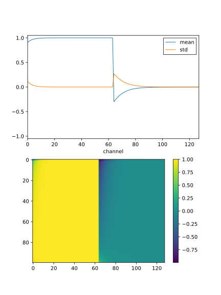
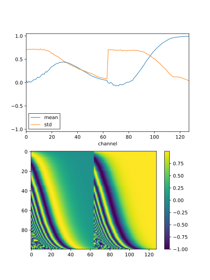

**************************
Evaluate EDM noise encoder
**************************

The EDM model [Karras2022]_ samples noise $\sigma$ from the following 
distribution:

$$
\log \sigma = -1.2 + 1.2 \, \mathcal{N}(0, 1)
$$

In other words, a random value is drawn from a Gaussian distribution with mean 
-1.2 and standard deviation 1.2, and that value is used as an exponent.  The 
purpose of this sampling procedure is to give a positive value between 0 and 
≈80, but to focus the sampling on values near 1.

Before the $\sigma$ value is passed to the denoising network, it is transformed 
as follows:

$$
\frac{\log \sigma}{4}
$$

The authors claim that the reason for doing this is to keep the inputs to the 
denoising network well standardized; e.g. mean around 0 and standard deviation 
around 1.  However, this doesn't make sense to me.  The pre-conditioned 
$\sigma$ value is passed directly into a sinusoidal encoder, which has no 
learnable parameters and will have well-standardized outputs no matter what the 
input value is.  Furthermore, from looking at the source code, I think that the 
minimum wavelength of this encoder is 1, which would in practice mean that the 
encoder would output very similar values for the vast majority of its inputs.  
I suspect that the actual standard deviation of its outputs would be very 
narrow.

Here I want to test my understanding of this situation by running snippets of 
code copied directly from the EDM respository.

Results
=======

  Embeddings for 1000 noise levels sampled using the [Karras2022]_ protocol.
  I believe that these embeddings are calculated exactly as described by 
  [Karras2022]_.

- The [Karras2022]_ model really does seem to be counter-productive.

  - Most of the channels are effectively constant.

  - The first channels vary quite slowly.

  - Of course, it would be possible for the linear layer right after the 
    embedding to amplify the small differences in the first channels.  The 
    information about the noise isn't lost, it's just compressed into a very 
    narrow band.  This compression is also reflected in the upper plot, which 
    shows standard deviation as a function of channel.

  Embeddings for 1000 noise levels sampled using the [Karras2022]_ protocol.  
  This time, the embeddings have minimum and maximum wavelengths of 0.1 and 80, 
  respectively, and the $\log \sigma$ preconditioning step is skipped.

- This looks much more like a proper positional embedding.

  - The standard deviations are much closer to 1, for many more of the 
    channels.

Discussion
==========
I'm going to use my embedding going forward.  Of course, I won't know which 
embedding truly works better until I try both, but the [Karras2022]_ embedding 
just seems wrong.
