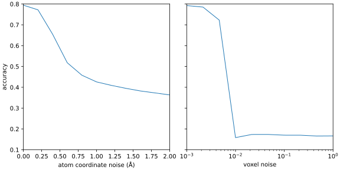

**********************
Evaluate discriminator
**********************

The output from a good discriminator should decrease monotonically as the input 
images get worse.  To test whether or not this is the case, I want to test two 
ways of manufacturing low-quality images.  The first is to add independent 
Gaussian noise to each voxel, the second is to add independent Gaussian noise 
the positions of the atoms before generating the image.

Results
=======

2024/09/30:

I compared two different kinds of noise:

- Atom coordinate noise: Gaussian noise added to the positions of the atoms, 
  before generating the 3D images.  The images themselves were generated 
  without noise.

- Voxel noise: Gaussian noise added to each voxel, after generating an image 
  from an unperturbed structure.  After adding this noise, the image is scaled 
  to maintain constant variance.

- This discriminator is sensitive to reasonable amounts noise in the atom 
  coordinates.

  - Below 0.2Å of noise, the model is relatively unaffected.

  - Between 0.2-0.6Å of noise, the model still seems able to glean some extra 
    information from the atom positions, but it's clearly affected by the 
    noise.

  - Above 0.8Å of noise, I assume the model is basically just latching on to 
    the large scale shape of the atom density; which faces of the two views 
    have atoms in roughly the same spots.  Perhaps that's good enough to get 
    35-40% accuracy, which is about 2x better than randomly guessing.

- The discriminator is insensitive to small amounts of noise added to each 
  voxel, but is completely broken by large amounts.

  - Below a standard deviation of 0.01, the model is mostly unaffected by 
    Gaussian noise.

  - Above a standard deviation of 0.01, the model might as well be randomly 
    guessing.

  - The transition is very sharp.  0.01 is about the standard deviation of the 
    input images themselves, so it might not be a coincidence that the 
    transition occurs around there.

Discussion
==========
- The ideal discriminator would be sensitive over a large range of noise.

  - The more range the discriminator has, the more low-quality generative 
    models can be compared.  This could be most useful in the initial phases of 
    hyperparameter optimization.

  - This discriminator seems to have reasonable sensitivity to atoms being 
    placed incorrectly, but poor sensitivity to random noise.  Fortunately, I 
    think it's much more likely that diffusion models will struggle with the 
    former and not the latter.  Since diffusion models are literally trained to 
    remove noise, the amounts they generate should be reasonably noise-free.

- I suspect that it might be hard to make a physics-based discriminator that 
  performs better than this, as I'm trying to do in :expt:`92`.  The reason is 
  that many of the force-field score terms I'd use, e.g. bond length and van 
  der Waals, penalize clashes very harshly.  I suspect that this would make the 
  discriminator perform poorly with even moderate amount of atom noise.

  It probably still worth trying, just to be sure.  And physics based methods 
  might be more helpful for reconstructing the protein sequence in the end.  
  But I think I can probably start training diffusion models with just the 
  ML-based discriminators.

- It might be interesting to run these discriminators on some more 
  subtly-incorrect models.  For instance, if I could get a dataset of decoys 
  from a Rosetta folding simulation, I'd like to see if there's a correlation  
  between accuracy and Rosetta score.

