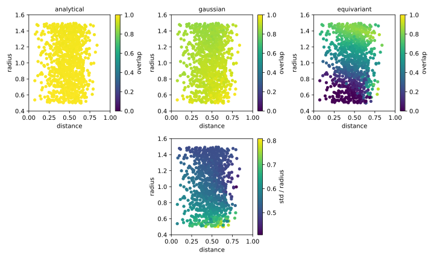

**********************************
Calculate sphere/grid intersection
**********************************

In order to convert atomic coordinates into a voxel grid, I need to be able to 
calculate how much of each atom falls into each grid cell.  If this calculation 
isn't accurate, the "apparent" location of each atom could depend on where in 
the grid cell the atom is centered.  In turn, this could impair the rotational 
equivariance of the whole network.

I ultimately found a library capable of performing this calculation 
analytically [Strobl2016]_, but I initially thought that I'd have to make an 
approximation.  Some approaches to this problem are described by [Jones2017]_:

- Monte Carlo simulations: Uniformly sample a number of points within each grid 
  cell, and calculate the fraction that fall within the sphere.

- Grid subdivision: Similar to the Monte Carlo simulation, but with evenly 
  spaced points.

- Edge intersection: Solve quadratic equation to find where the sphere 
  intersects each edge of the cube.  The average edge length is a approximation 
  for the intersection volume.

- Convex hull: Find edge intersections in the same way as above, then calculate 
  the volume of the polygon formed those points.  

Some of the 3D CNN/protein papers I've read have used Gaussian distributions to 
determine which cells to fill.  Specifically, the idea is to (i) evaluate a 
spherical normal distribution at the center of each grid point within range, 
then to (ii) normalize all the results.  This result would be pretty close to 
equivariant, since the Gaussian distribution itself is radially symmetric.  The 
only error would come from deciding which cells to fill in this way.

My goal here is to compare some different ways of calculating sphere/grid 
intersections.  These comparisons ends up being a bit pointless, since the 
analytical solution is clearly the best, but it's still worth recording what I 
did.

Results
=======
I calculated "true" intersection volumes using a Monte Carlo simulation.  I 
choose this approach because it's easy to implement, unbiased, and (by 
increasing the length of the simulation) accurate to any desired level of 
precision.

I compared three algorithms:

- The analytical solution from [Strobl2016]_, as implemented by the `overlap` 
  package:

  - Really this is just making sure that I'm using the library correctly.

  - There's another package called `voxelize` that uses `overlap` to voxelize a 
    set of masses/densities.  It's multithreaded: each different mass/density 
    can be simultaneously voxelized.  But it's also harder to install, and I 
    didn't see an option to specify the origin.  I decided that I'd rather just 
    use `overlap` directly.  I don't think this will be a bottleneck.

- Gaussian distribution:

  - The question here is what standard deviation to choose.  This will depend 
    on the relative size of the sphere and the grid cell.  I optimized this 
    parameter for each benchmark point, and plotted both the optimized overlap 
    and the optimized standard deviation.  The optimized standard deviation 
    isn't quite a linear function of the radius, but it's close.  A value of 
    ≈0.6 times the radius works pretty well for the kinds of radii/cell lengths 
    that I expect to encounter.

- Equivariant neural network:

  - I had the thought that I might be able to train a neural network to perform 
    well on this task.  Ultimately, though, the results are very underwhelming.

  - Equivariance:

    - This problem has octahedral symmetry, because it's symmetrical w.r.t the 
      face of the cube the sphere is nearest to.  (Recall that cubes and 
      regular octahedra are twin shapes, and have the same symmetries.)

  - Dirichlet score function:

    - I trained the network on the results of the Monte Carlo simulations.

    - These results are really multinomial samples:

      - A multinomial distribution describes the results of rolling N 
        independent K-sided (weighted) dice.

      - Here, the grid cells correspond to the faces of the dice, the weights 
        correspond to the degree of overlap between the sphere and the grid 
        cells, and the rolls correspond to the independent samples made on each 
        iteration of the Monte Carlo algorithm.

    - The multinomial distribution gives a way to calculate the probability of 
      observing some data, given that we know the probabilities of a point 
      landing in each cell.  Of course, we don't know the probabilities: 
      they're directly proportional to the volumes we're trying to calculate.

    - In other words, we know $p(x | \theta)$ but we want $p(\theta | x)$.  
      We can use Bayes rule:
      $$
      p(\theta | x) = \frac{p(x | \theta)p(\theta)}{p(x)}
      $$

    - The Dirichlet distribution is the conjugate prior of the multinomial 
      distribution, so we know that if we choose a Dirichlet prior, the 
      posterior will also be Dirichlet.

    - I thought this would be a good loss function for training a neural 
      network: 

      - Specifically, I'd calculated the log probability of the $\theta$ 
        predicted by the network, using a Dirichlet distribution parametrized 
        with the counts from the Monte Carlo simulation.

      - This approach naturally uses the data from the Monte Carlo simulation, 
        in a way that accounts for their uncertainty.

      - The loss function has a single minimum, which corresponds exactly to 
        the desired predictions.  I'm also pretty sure it's smooth everywhere.

    - However, this approach didn't work.

      - I kept getting NaNs in the gradients after a few rounds of training.  
        Neither reducing the optimizer step size nor smoothing the distribution 
        (by reducing the number of Monte Carlo samples) had any effect.

  - L1 score function:

    - Since the Dirichlet loss function didn't work, I used an L1 loss instead.  
      Here, the expected value was not a distribution, but the normalized 
      counts for each cell.

    - I also tried an MSE loss function, but this gave an error about some sort 
      of data type mismatch that I didn't understand.

  - Hyperparameters:

    - I tried varying the length of the training, the size of the latent 
      representation, and a few other things.  Nothing had any noticeable 
      effect on the results.

  - I think there was probably something I was doing wrong, and it bothers me 
    that I couldn't figure out what it was.  This is a very small problem, and 
    I can't see why a neural network wouldn't be able to perform well.  That 
    said, it's not worth sinking a bunch of time into this.

Each algorithm is applied to 1000 spheres.  Each sphere has a uniformly random 
radius (between 0.5 and 1.5) and a uniformly random position within a single 
grid cell.  Each grid cell has sides of length 1.  The plots above condenses 
the spatial coordinates into a distance between the center of the sphere and 
the grid cell.  This transformation is they the points don't look uniformly 
distrusted.  The reported overlap is the similarity between the algorithm and 
the Monte Carlo result.
