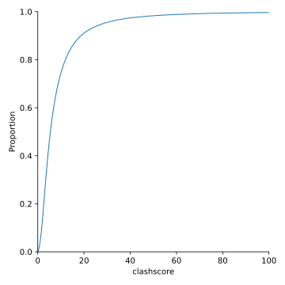

**********************
Choose clashscore bins
**********************

When sorting assemblies based on clashscore, I want to discretize the scores so 
that I use other metrics, such as $R_\mathrm{free}$, to choose between 
assemblies with similar packing.  Here I just want to look at the distribution 
of clashscores in the PDB, to determine what a good bin size might be.

Results
=======
.. figure:: clashscore_hist.svg

- 80% of clashscores are below 12.

Discussion
==========
- The real question is: how close can two clashscores be before they're really 
  not significantly different anymore.  Unfortunately, I don't have an 
  intuition for this.

- I think it makes sense to have 20-50 bins.

  - I'm planning to discretize resolution by tenths of angstroms, partially 
    because that's all that some structures report, and partially because I 
    don't think differences beyond that are very significant.  Given that the 
    highest resolution structures are 0.6Å, and the lowest resolution I'll be 
    filtering on is 4.0Å, that adds up to about 35 bins.

  - With a comparable number of clashscore bins, there will be about 1000
    combined bins.  With the PDB containing hundreds of thousands of 
    structures, that means that there will be on average 100 structures per 
    bin.  That seems like a reasonable number to sort on other metrics.

  - Resolution and clashscore are likely correlated, so I probably want to err 
    on the side of having more bins.

  - If I rounded clashscores to the nearest 0.2, that would yield 60 bins 
    between 0 an 12.

