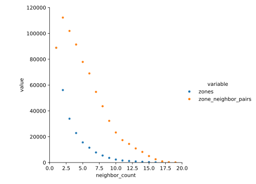

***********************
Compare neighbor counts
***********************

2024/05/02:

In the initial version of the dataset, each zone can have 1-20 neighbors (as 
there is one neighbor for each icosahedron face).  I'm curious what the 
distribution of neighbor counts looks like.  In particular, I'm hoping that 
this information will help me decide whether an epoch should consist of 
visiting all zones, or all zone/neighbor pairs.

Results
=======

Reasonable epoch size
---------------------
I looked at the number of training iterations I used for 
``20231116_compare_resnets``:

- Epochs: 500
- Training epoch size: 64,000
- Validation epoch size: 6,400
- Total training iterations: 32,000,000

Neighbor counts
---------------

- Most zones have 1-2 neighbors.

- The number of neighbors/zone decreases faster than the number of neighbors 
  itself.  So even if I sample zone/neighbor pairs, I'll still end up sampling 
  mostly zones with 2 neighbors, as opposed to those with 20.

.. datatable:: count_neighbors.xlsx

- There are 3x more zone/neighbor pairs than there are zones.

Discussion
==========
- My initial inclination is to iterate over zone/neighbor pairs.

  - It seems like the more proper thing to do.

  - It would mean placing a greater emphasis on "big" structures.

- Iterating over zone/neighbor pairs means seeing the same center more often, 
  as compared to iterating over zones.  Alternatively, you could see it as 
  spending more time on the more difficult predictions.

- It's worth noting that the neighbors themselves are also likely to be near 
  zones, since the criterion for defining a zone is the same as for defining a 
  neighbor.  I don't think this really affects anything, though.  It's kinda 
  the same as if I decided to randomly swap the zone and neighbor when 
  generating the training example.

- I do worry that enriching the dataset for certain zones (i.e. those with more 
  neighbors) might cause the model to over-learn features of those zones, 
  whatever they may be.  In contrast, sampling uniformly over space won't add 
  any bias that isn't already in the dataset.  But it might make the learning 
  task easier.

  - I'm kinda persuaded by this point.  I went to a lot of effort to remove 
    redundancy from the dataset; do I really want to add it back in at the end?

- Maybe the best thing is to write the code to accommodate both approaches, or 
  even a more general approach where I can assign arbitrary weights to the 
  zones.

