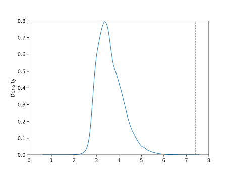

*******************
Prepare QM9 dataset
*******************

I decided to try using the QM9 dataset for hyperparameter optimization.  
Briefly, this dataset consists of "geometric, energetic, electronic, and 
thermodynamic properties for 134k stable small organic molecules made up of 
CHONF" [Ramakrishnan2014]_.  My hope was that QM9 would be faster than my 
neighbor location dataset, and less noisy than the ligand-binding affinity 
dataset.

.. note:: 

  I'm using the splits and dataloaders from the ATOM3D project, which refers to 
  this dataset as SMP ("small molecule properties") rather than QM9.

Considerations
==============

Properties
----------
The QM9 dataset includes 15 different properties for each molecule.  It's not 
clear to me which of these properties I should predict, or even if I should 
predict all of them at once.  I skimmed a few papers that use the QM9 dataset, 
found on https://paperswithcode.com/dataset/qm9

- [Faber2017]: Uses all metrics, but claims they all gave similar results, and 
  only discusses $U_0$.

- [Simeon2023]: Uses $U_0$, $U_298$, $H_298$ and $G_298$.  Note that these all 
  seem highly correlated.

- [Wu2018]: Recommends comparing average MAE over all metrics.  I don't think I 
  understand this recommendation, because each property has a very different 
  scale, so simply averaging the 15 MAEs would severely overweight the 
  properties with larger scales.

- [Townshend2022]_ (the ATOM3D paper): Shows results for 8 of the metrics 
  (although notably only the atomic version of the energy metrics, which seem 
  easier to predict; see below) in Supplementary Table 8.  Not clear if these 
  were separately trained models, or a multi-output regression.

  Note also that the CNN performs much worse at this task than the GNNs do.  
  The authors attribute this to the relatively reduced importance of many-body 
  interactions, and the lack of exact distances.  It'll be interesting to try 
  spherical atoms, which should help with the latter concern.

I plotted each of the properties against the number of atoms, just to get a 
sense for how predictable each is.  A lot are surprisingly predictable:

.. figure:: visualize_smp_dataset.svg

For now, I'm just going to do single regressions.  I'm not exactly sure how the 
loss function works for multi-output regression, but I'm worried that it might 
overweight the properties with the largest scales.  

I want to choose a single property to focus on for now; I think that's all I 
need for the purposes of hyperparameter optimization.  It probably doesn't 
really matter which property I choose, but I did put some thought into it:

- Dipole moment ($\mu$): This seems like a property that would be relevant in 
  the context of a protein.

- Isotropic polarizability ($\alpha$): I think this is closely related to 
  $\mu$, even if the scatter plots above don't show it.  

- HOMO/LUMO gap ($\epsilon_\textrm{gap}$): I think this relates to the 
  stability of a small molecule, i.e. if the HOMO and LUMO are closer, the 
  molecule will be easier to excite.

- Electronic spatial extent ($R^2$): Although not that correlated with atom 
  number, seems like it might be correlated with input volume.

- Zero point vibrational energy: Too highly correlated with number of atoms.

- Internal energy ($U_0$, $U$), enthalpy ($H$), and free energy ($G$): I'm 
  hesitant to use these ones.  I'm not sure how exactly they're related to the 
  their "atomic" versions, but the latter seems quite predictable.

My top two choices were $\mu$ and $\epsilon_\textrm{gap}$.  Both seem 
non-trivial to predict, but I decided to go with $\mu$ because it seems more 
relevant in the context of protein design.

Distance cutoff
---------------
I measure the maximum distance between each atom and the center of its 
molecule.  This metric is important because it determines how many voxels are 
needed to fit the whole dataset:

- The greatest distance is 7.40Å.

- This is consistent with the 7.5Å radius (corresponding to a 16 voxel/side 
  grid at 1Å resolution) used by the ATOM3D example CNN.

I decided that I wanted to truncate the dataset to only those molecules that 
don't go more than 5Å from the center.  Such molecules will fit in a box with 
10Å sides, since the shortest distance from the center of a cube to its 
exterior is half the edge length.  As you can see above, this isn't a stringent 
threshold: it only removes ≈2% of the data.

The advantage of this filter is that it allows me to test resolutions up to 
0.5Å with my usual 21 voxel/side grids.
