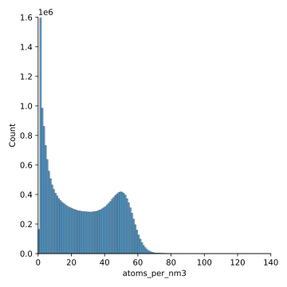

********************
Measure atom density
********************

I want to be able to restrict my training set to non-surface regions of 
macromolecules, because I think that it might be too easy for the algorithm to 
"cheat" if it knows where the surface is.  

Now that I say that, this seems like something I should worry about later; not 
before I've done any training.  It's very possible that it won't be a problem 
at all, and if it isn't, I'd of course rather train in as many different 
environments (e.g. surface and non-surface) as possible.

Regardless, in order to identify non-surface regions, I want to count the 
number of atoms in a given region.  My hypothesis is that most protein cores 
have a relatively constant density of atoms, and so I'll be able to distinguish 
regions that are "full" of atoms (non-surface) from those that aren't 
(surface).

Results --- 2023/07/07
======================
- Run ap_choose_origins

    - 5Å sphere

- Make histogram of neighbor counts

- Look at structures

  - Do origins with 25 atom seem buried?
  - What's going on with origins with 40 atoms?  Are there clashes?  Some thing 
    I'm not considering?

- Buried regions: seem to get 26-35 atoms usually

- Surface regions: seem to get 20-30 atoms usually.

- I could set a limit of 25, but that wouldn't do much.

- The waters are probably not helping.

Results --- 2024/04/03
======================
I decided to re-implement this analysis, because the old code no longer ran, 
and I hadn't saved a plot of the results.  This time I did the calculation a 
little differently.  I didn't rely on the neighbor counts recorded in the 
"origins" dataset.  Instead, I binned the coordinates of each asymmetric unit 
in the PDB, and counted how many atoms ended up in each bin.

- This figure only has 34% of the structures in the PDB, but the results don't 
  seem to change much as more structures are added.

- 50 atoms/nm³ seems to be "well packed".

  - Densities higher than that become very uncommon very quickly, so this seems 
    like something of an upper limit.

  - Densities lower than that are also less common, but don't disappear 
    entirely.  This makes sense, because there are surely plenty of bins that 
    contain some amount of empty space.

  - Note that the 5Å radius sphere used in my previous calculation has a volume 
    of 0.52 nm³, so the ≈30 atoms/sphere that I regarded as well-packed 
    corresponds to a density of 57.3 atoms/nm³.  This is on the high end of 
    densities that I observe here, but not unreasonable.

  - There are some structures with densities greater than 100 atoms/nm³.  I 
    looked at one such example: 7tbm.  This structure does in fact seem to have 
    regions where multiple chains (e.g. A4 and A6) are superimposed on top of 
    each other.  So in this case my density calculation is correct, but the 
    underlying structure is wrong.

    I might only want to include training examples that are below 70 atoms/nm³, 
    just to try to avoid these pathological cases.  It's not perfect, though.  
    Even two superimposed structures could have regions that contain clashing 
    atoms, but are below that density.

- Looking at 3nxj:

  - It seems like 40 atoms/nm³ is about the limit for what I'd consider a 
    "full" image.  Below that, and there's a lot of empty space.

  - As seen in the histogram above, 50 atom/nm³ is clearly representative of 
    occupied regions of space.
